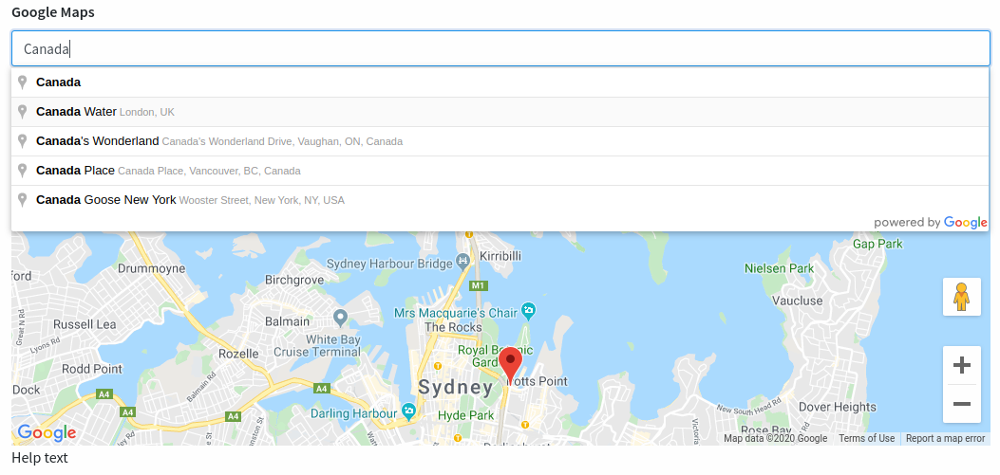

#### Custom Google Maps Input for Laravel Backpack


#### How to install

with composer:

```bash
// TODO
```

#### How to use

Publish package assets with:

```bash
// TODO
```

Add your Google Api Key to the env file:

```
GOOGLE_MAPS_API_KEY= 
```

Add this to your backpack controller:

```php
$this->crud->addField([
    'name'  => 'address-input', // do not change this
    'type'  => 'customGoogleMaps', // do not change this
    'label' => "Google Maps",
    'hint'  => 'Help text',
    'attributes' => [
        'class' => 'form-control map-input', // do not change this, add more classes if needed
    ],
]);
```

#### Preview:

